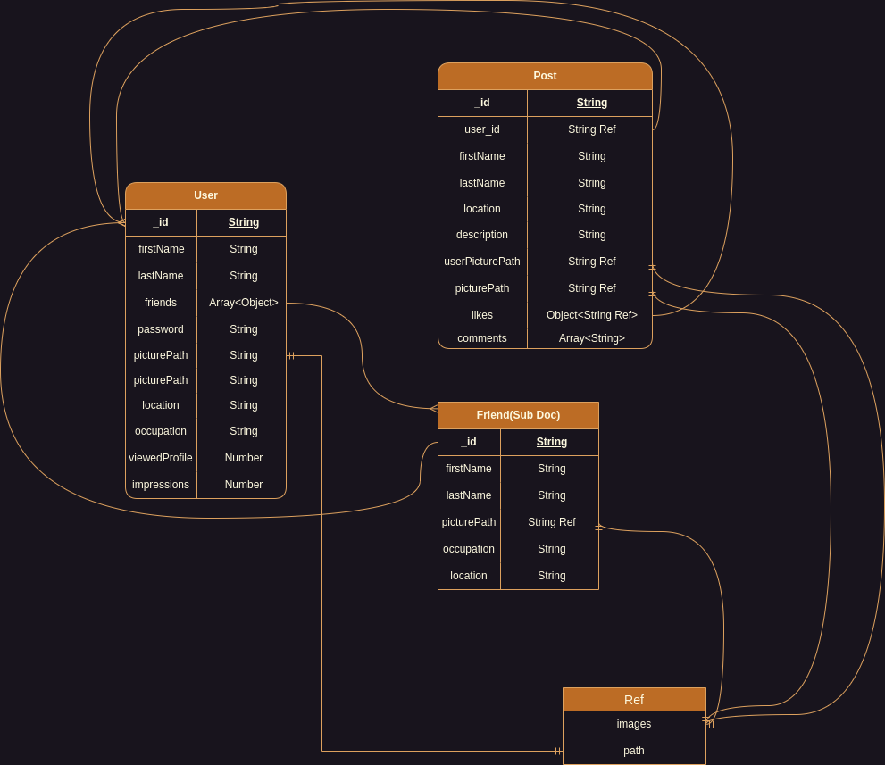

# MERN Stack Social Website

This project is a basic social website built using the MERN stack (MongoDB, Express.js, React.js, Node.js) with dark mode and Material-UI.

## Tech Stack

- MongoDB: A source-available cross-platform document-oriented database program.
- Express.js: A back end web application framework for Node.js.
- React.js: A JavaScript library for building user interfaces.
- Node.js: A JavaScript runtime built on Chrome's V8 JavaScript engine.
- Material-UI: A popular React UI framework.

## Features

- User Authentication: Sign up, log in, log out.
- Profile Management: View and edit user profiles.
- Post Management: Create, read, update, delete posts.
- Dark Mode: Toggle between light and dark themes.
- Responsive Design: Adapts to various screen sizes.
- Material-UI: Utilize Material-UI components for a modern look and feel.

## Getting Started

1. Clone the repository.
2. Install dependencies with `npm install`.
3. Start the server with `npm start`.
4. Visit `localhost:3000` in your browser.

## Backend Database ERD

### Future Enhancements

- Implement real-time chat functionality.
- Add more comprehensive user settings.
